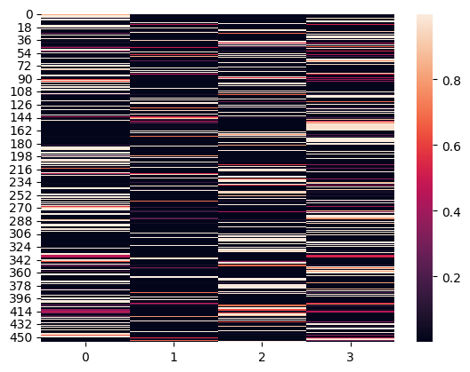

## Text classification test

Notebook running order
- `DatawPrep.ipynb` Prepare the data, with the following columns:
- `EDAreal.ipynb` Exploratory Data Analysis to find any misclassification in the data
- `Train.ipynb` Train
  - Hyperparams tuning: Split the training to 50-50 to tune the hyperparameters. Later use best paramenters to train on the whole training set.
  - Log experiments to Tensorboard  
- `Inference.ipynb` Inference and error analysis to see which datapoint is the most likely to be misclassified.
  - By class
  - By text length
  
### Assumption
- Zero length strings can have different labels, and it is tricky to determine using pure text method. Therefore I do not train and evaluate them.
- Do not remove punctuation marks since it can have some clue to predict the label. For example (`from:` is for `question`, `* Where Applicable` is for `other`).
### Error analysis
- Accuracy: 79.87%.
- Baseline: Always return label as `question`: 47.14%.
- Confusion matrix: The order is `question`, `header`, `other`, `answer`. Row: Actual label, Column: Predicted label.
```
      [[687,  19,  56,  47],
       [ 21,  46,   5,  47],
       [ 75,  14, 159,  24],
       [ 51,  36,  62, 921]])
```
I also tried to see if the entropy for misclassification is high or not. Unfortunately they are pretty low (Many black splots in the heatmap). Therefore, the algorithm is confident that is is right, even when it is wrong

